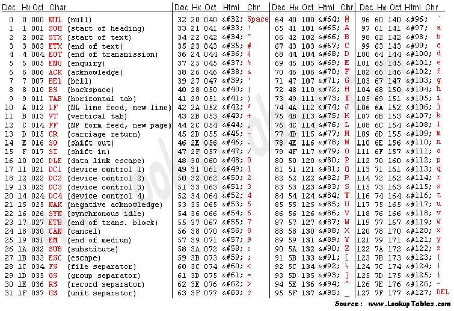
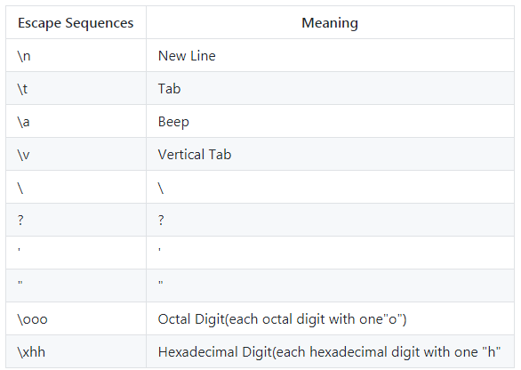

# C++ Tutorial


# Introduction to C++

What is C++?

C++ is a popular programming language which can write codes at both processor level and application level. Using this language, we can develop a variety, from operating systems to software or toolkits we use for various daily life and other purposes. See! Can you imagine such a wide range of applications for just a single language? And some concepts of this like object oriented are really very simple! This is the reason it is one of my favourite programming languages.

So are you excited to learn C++? Let us get started.

# C++ Compilers

You can use GCC as a compiler and Notepad++ as a code editor. Or else even you can use the Visual Studio along with VSCode(Visual Studio Code). Note that if you want it free, don't take professional or enterprise version because it is free only up till 30 days or if you keep siged in, up till 90 days. Take community version of Visual Studio, just remember it can not be used for business. You can also use Code::blocks as a code editor and IDE. You can also take CLion, just remember that it is paid.

# C++ "Hello World"

```C++
#include <iostream>
using namespace std;

int main() {
  cout << "Hello World" << endl;
  return 0;
}
```
```
Hello World
```
I know that at start this code may seem difficult, but as soon as you understand it, it is nothing more than half a piece of cake.  
Now, just note that this C++ tutorial will not be able to make you understand everything clearly, but can obviously provide you the things like the import links and all.  
Also, you can grab the code from here for editing. But if you really want all the proper explanations, then see our [C++ Course on Youtube](https://www.youtube.com/playlist?list=PLmWXQgLAMBwGqz9EpLcquRsbP4wF1RwNb).
"#include <iostream>" means that the <iostream> header file is included inside.
"using namespace std" means that the "std" namespace is assumed to be used in all the ones where required. Without it, the code would look like
"cout << " is used for printing console output. "endl" is not compulsory. "endl" does the same thing as "\n" escape sequence(below). The only difference is that "endl" also flushes the stream. So `cout << endl;` is equivalent to `cout << "\n" << flush`.
```C++
#include <iostream>
  
int main() {
  std::cout << "Hello World" << std::endl;
  return 0;
}
```
When you compile this code or the previous one, then you will notice that as you open the binary file, the console closes within a second. So instead of just writing the code, use the common exit code also. After that the code will look like
```C++
#include <iostream>
#include <conio.h>
using namespace std;

int main() {
  cout << "Hello World" << endl;
  getch();
  return 0;
}
```

# C++ Escape Sequences and ASCII Table




# C++ Data Types

There are two types of data types in C++: Primitive and Non-primitive.
Primitive Data Types: Primitive data types are all predefined data types. All these are variables. E.g. Integer
Non-primitive Data Types: Non-primitive data types are all user-defined data types. Except for strings, all non-primitive data types are not variables. E.g. Array

# C++ Variables

C++ Variables are like storage cotainers in real life. They store some value. They are classified on the basis of the type of data stored in them. Before we see those types, let us see a very basic code using C++ variables.
```C++
#include <iostream>
#include <string>
using namespace std;

int main() {
  string x = "Hello World";
  cout << x;
  retun 0;
}
```
